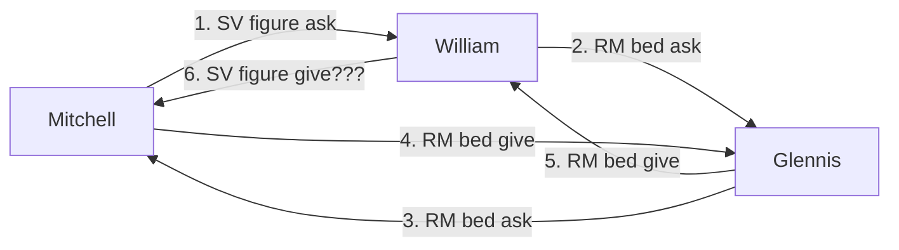
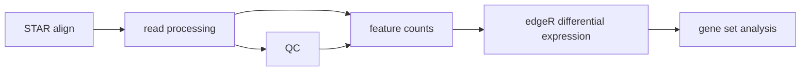
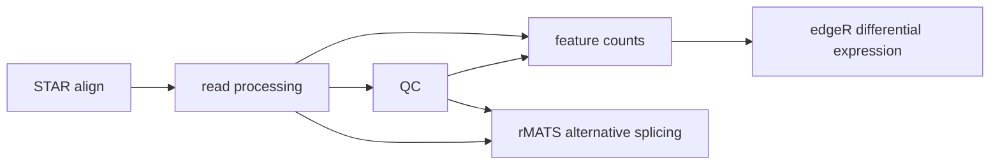

```
test
```


```mermaid
graph LR;
    Mitchell--1. SV figure ask-->William--2. RM bed ask-->Glennis
    Glennis--5. RM bed give-->William
    Mitchell--4. RM bed give-->Glennis
    Glennis--3. RM bed ask-->Mitchell
    William--6. SV figure give???-->Mitchell
```


```mermaid
  graph LR;
      A[STAR align]-->B;
      B[read processing]-->D;
      B-->C;
      C[feature counts];
      D[QC];
      D-->C;
      C-->E[edgeR differential expression];
      F[gene set analysis];
      E-->F;
```


```mermaid
  flowchart LR;
      A[STAR align]-->B;
      B[read processing]-->D;
      B-->C;
      C[feature counts];
      D[QC];
      D-->C;
      C-->E[edgeR differential expression];
      D-->F[rMATS alternative splicing];
      B-->F;
```
# sd-divergence-paper-analysis
