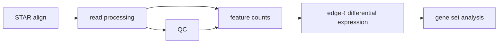
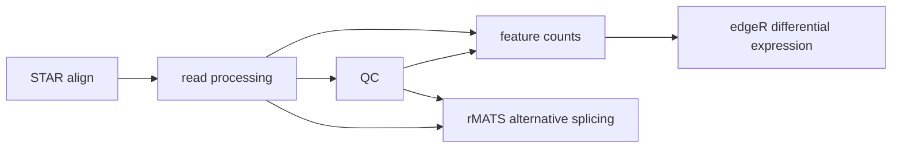

```
test
```


```mermaid
graph LR;
    A-->B
```


```mermaid
  graph LR;
      A[STAR align]-->B;
      B[read processing]-->D;
      B-->C;
      C[feature counts];
      D[QC];
      D-->C;
      C-->E[edgeR differential expression];
      F[gene set analysis];
      E-->F;
```


```mermaid
  flowchart LR;
      A[STAR align]-->B;
      B[read processing]-->D;
      B-->C;
      C[feature counts];
      D[QC];
      D-->C;
      C-->E[edgeR differential expression];
      D-->F[rMATS alternative splicing];
      B-->F;
```
# sd-divergence-and-igc-figures
